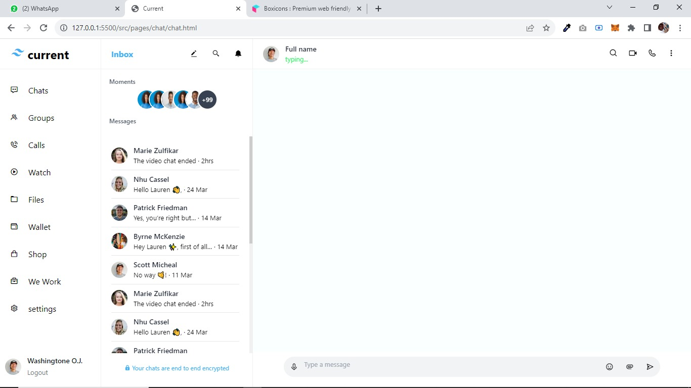
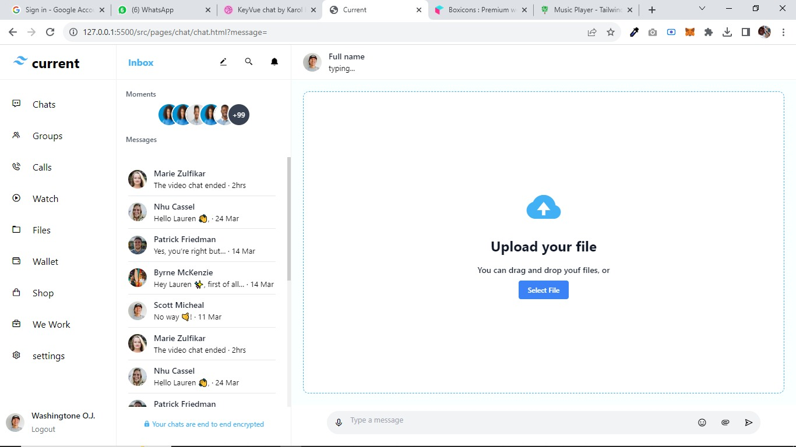
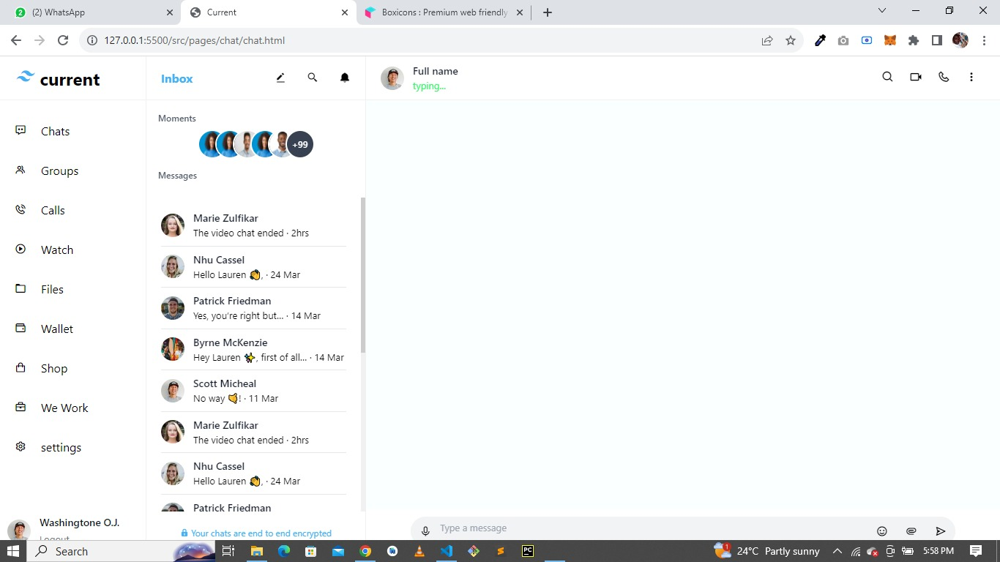
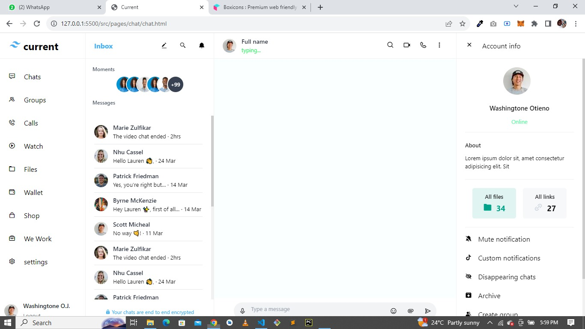
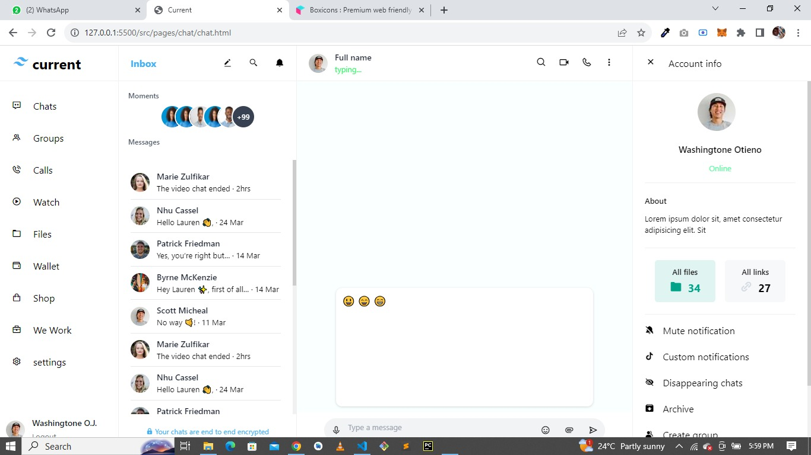
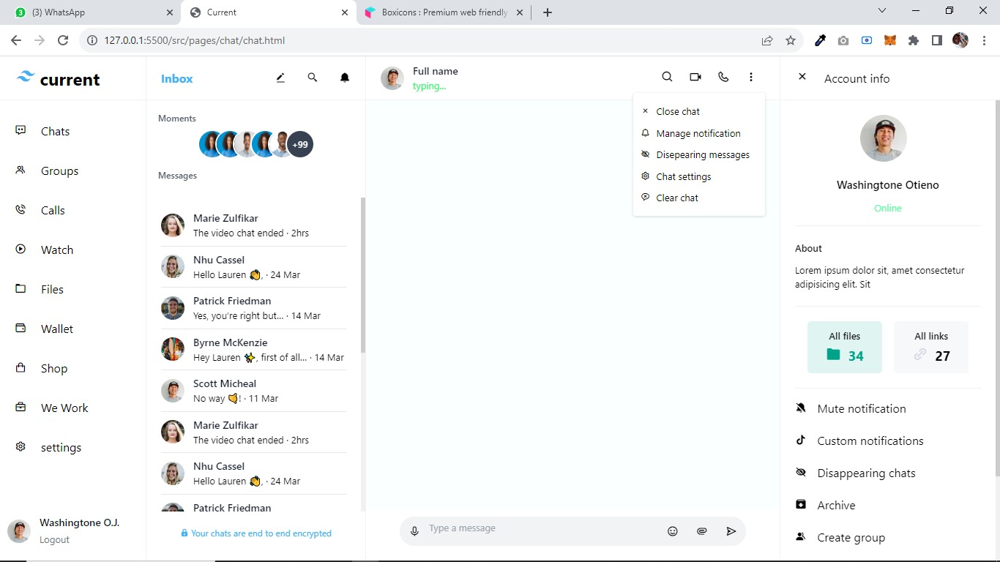
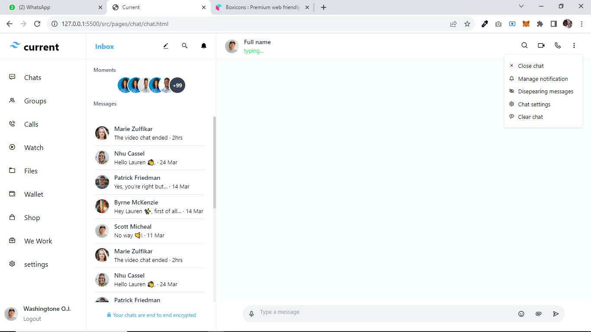

# Current

This is an interactive chat user interface, buitl with the aim of adding more features to in real-time conversations, making communication enjoyable. Note that it is still under development, and at the moment does not provide responsive capabilities. something i am working on.

## Features

- [x] Customize your profile with avatars and display names to make your chat more personal.
- [x] Express yourself with a wide range of emojis and stickers to add fun and emotion to your conversations.
- [x] Share Extremely large files and documents effortlessly within the chat interface, enhancing collaboration.
- [x] user profile website

I value your feedback! If you have suggestions for improvements, or would like to contribute to this project, please open an [issue](https://github.com/Oj-washingtone/Current/issues) or create a [pull request](https://github.com/Oj-washingtone/Current/pulls).

## Screenshots

